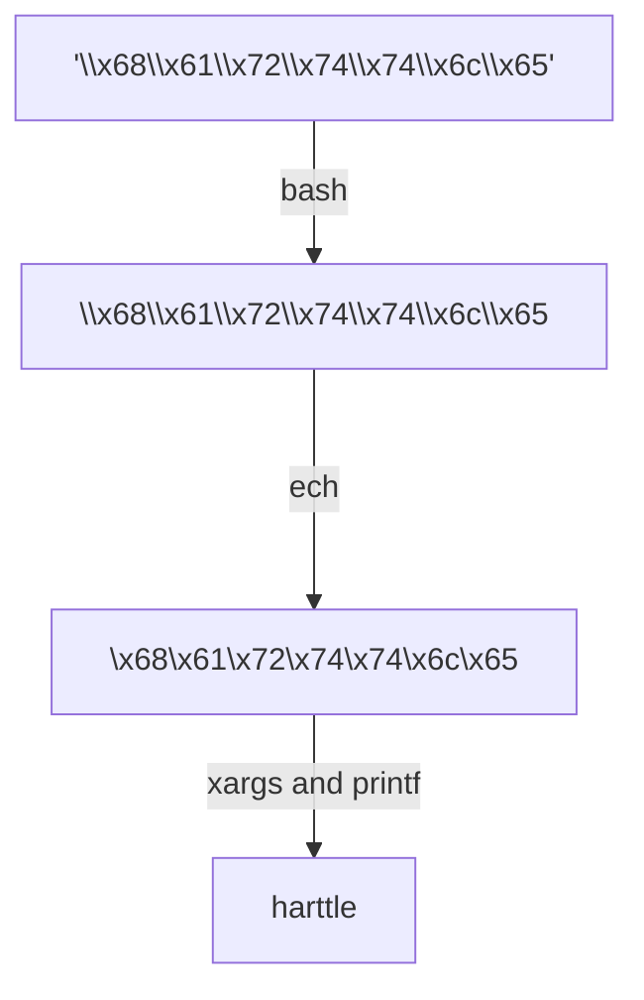

<!-- toc -->
shell脚本实质是一系列命令。空格 token split.
# 逐行读取文件
- 用awk
```shell
cat myfile |awk '{print "Line contents are: "$0}' 
```
- 管道
```shell
cat myfile |
while read rows 
do
 echo "$rows"
done
```
- 输入重定向
```shell
while read rows 
do
 echo "$rows"
done < myfile           
```

# Bash 斜杠和引号

## 如何输入/输出引号

```shell
# 只有单引号，加双引号
# 只有双引号，加单引号
# 既有单又有双
echo 'he'\''s she'\"'s'>log.txt;cat log.txt
```

## 基本知识点

引用于[Bash 转义和引号的使用](https://harttle.land/2020/06/26/bash-quote-escape.html#header-0)

1. 反斜线用来转义除换行之外的所有字符，反斜线加换行为连行;
2. 单引号用来直出字面量，其内容部分不允许转义，包括单引号转义也不允许；
3. 双引号内允许 [命令替换](https://www.gnu.org/software/bash/manual/html_node/Command-Substitution.html#Command-Substitution) 和对特定几个字符转义，双引号内的反斜线对其他字符没有特殊含义，会被当作字面量处理。
4. 字符串会被处理两次，先被shell处理一次，再被具体程序（如echo）处理一次。

## 一个例子

如果不熟悉 Bash 引号的语义，尤其是配合管道和 xargs 等命令时，事情会变得很复杂很难以理解。 比如下面的命令把 16 进制 ASCII 转为字符串 `harttle`：

```
echo '\\x68\\x61\\x72\\x74\\x74\\x6c\\x65' | xargs -0 printf '%b'
```

如果没有加引号或没有加 `-0` 都不会得到正确的结果，二者都会影响参数如何转义。 在介绍完规则后我们重新来看这个例子。

## 斜杠的使用（Bash 转义）

一、续行符

Bash（Posix）转义规则很简单：

二、**反斜线用来保持字面量**。Bash 里反斜线用来转义下一个字符，保持下一个字符的字面值。 比如 `\$` 表示字面量 `$`，否则如果没有反斜线 `$` 会被 [Bash 参数展开](https://www.gnu.org/software/bash/manual/html_node/Shell-Parameter-Expansion.html#Shell-Parameter-Expansion)。 例如：

```
# echo 将收到字面量 \x68\x61\x72\x74\x74\x6c\x65，下一个字符 \ 被保持
# 输出 harttle
echo \\x68\\x61\\x72\\x74\\x74\\x6c\\x65

# echo 将收到字面量 x68x61x72x74x74x6cx65，下一个字符 x 被保持
# 输出：x68x61x72x74x74x6cx65
echo \x68\x61\x72\x74\x74\x6c\x65
```

注意 Shell 只负责处理参数和调用命令，不会识别 `\t`, `\n`，`\x68` 等其他编程语言里的 ASCII 特殊字符，这些特殊字符的处理通常在具体的软件中，比如 `echo`, `printf` 等。 例如下面的命令会输出 `a b`：

```
echo 'a\tb'
```

但 `\t` 的语义并不是由 Shell 表达的，Shell 只是把这个长度为 4 的字符串 `"a\tb"` 传递给 `echo` 程序，后者将会收到参数 `argv[1] === "a\\tb"`。

二、**反斜线+换行例外**。反斜线后一个字符是换行（`<NL>`）时上一条规则例外。 这时 `\<NL>` 表示连行，一个命令可以分行写。换句话说 `\<NL>` 等效于会在解析时删除。 比如：

```
cat log.txt |\
grep a |\
grep b
# 等价于
cat log.txt | grep a | grep b
```

## 单引号的使用

单引号用来保持引用内容的所有字面量，包括反斜线。也就是说一对单引号中不得出现单引号，它前面有反斜线也不行。 例如下面的命令将会输出 `harttle`：

```
# echo 将收到字面量 \x68\x61\x72\x74\x74\x6c\x65
echo '\x68\x61\x72\x74\x74\x6c\x65'
```

如果单引号之间出现单引号，引用内容立即结束（来自其他编程语言的同学注意）。 比如：

```
$ echo 'foo\'bar'   # 回车
quote>              # Shell 继续等待输入，因为第一个引用内容是 foo\
                    # 紧接着是字面量 bar，然后是一个未关闭的 '
quote>'             # 输入 ' 结束第二个引用内容（为空字符串）并回车
foar                # echo 收到的输入为 foo\bar，\b 被 echo 解释为退格
```

这个情况经常在尝试转义单引号里的单引号时发生，比如 `sed 's/\'/"/g'`, `grep 'harttle\'s'` 都是错误的写法。

## 双引号的作用

双引号也是保持引用内容的字面量，但 `$`, `` ` ``, `\` 除外（POSIX 标准）。 其中：

1. `$` 用来做 [Bash 参数展开](https://www.gnu.org/software/bash/manual/html_node/Shell-Parameter-Expansion.html#Shell-Parameter-Expansion)，比如 `echo "my name is $name."`。
2. `` ` `` 表示 [命令替换](https://www.gnu.org/software/bash/manual/html_node/Command-Substitution.html#Command-Substitution)，基本等价于 `$()`。
3. `\` 是我们讨论的重点，它用来转义。

Shell 转义奇怪的是反斜线后是 `$`, `` ` ``, `"`, `\`, `<NL>` 时反斜线才表示转义，否则反斜线没有特殊含义（表示一个反斜线字面量）。 例如下面两个命令都会输出 `harttle`，因为 `"\\x"` 的第一个反斜线表示转义，解释为 `"\x"`，而 `"\x"` 中的反斜线没有特殊含义，也解释为 `"\x"`。

```
echo "\\x68\\x61\\x72\\x74\\x74\\x6c\\x65"
echo "\x68\x61\x72\x74\x74\x6c\x65"
```

其中 `\<NL>` 和单引号一样表示连行，`\"` 表示字面量双引号，注意这在单引号语法中是不允许的。

## 案例分析

现在继续看本文刚开始的例子：

```
echo '\\x68\\x61\\x72\\x74\\x74\\x6c\\x65' | xargs -0 printf '%b'
```

1. 由于 echo 的参数使用单引号，echo 收到的参数为字面量 `\\x68\\x61\\x72\\x74\\x74\\x6c\\x65`。
2. 因此 `echo '\\x68\\x61\\x72\\x74\\x74\\x6c\\x65'` 的输出为：`\x68\x61\x72\x74\x74\x6c\x65`。
3. 由于 `xargs -0` 下标准输入会被当做字面量处理（`\` 不再是特殊字符），`xargs` 给到 `printf` 的第二个参数为字面量 `\x68\x61\x72\x74\x74\x6c\x65`，第一个参数为 `%b`。
4. `printf` 处理十六进制 ASCII 字面量语法，输出 `harttle`。

图解：



有两点需要注意：

- 如果 echo 的第一个参数只有单个反斜线（`\x68\x61\x72\x74\x74\x6c\x65`），echo 的输出即为 `harttle`，经过 `printf` 后仍然为 `harttle`；
- 如果 `xargs` 没有添加 [`-0` 参数](https://www.gnu.org/software/findutils/manual/html_node/find_html/xargs-options.html)，`xargs` 会把它的标准输入正常做 Bash 转义，也就是说 `xargs` 给到 `printf` 的第二个参数将会是 `x68x61x72x74x74x6cx65`，因为 Bash 转义中 `\x` 的语义（见“转义”一节）和 `printf` 转义中 `\x` 的语义不同。

# shell例子 - 重命名脚本

变量定义 `h="hello"`
变量引用 `$h`
变量可连接 `echo "abc$hxyz"`
防止变量歧义 `"abc${h}xyz"`

重命名 week->chapter
井号掐头，百分号去尾
```shell
for ff in week??
do
echo $ff
done

for ff in week??
do
echo ${ff#week} #掐头
done

for ff in week??
do
echo chapter${ff#week}
done

for ff in week??
do
echo " mv $ff chapter${ff#week}"
done

for ff in week??
do
mv $ff chapter${ff#week}
done
```

# 执行脚本的方式
1. bash或sh+脚本的相对路径或绝对路径（不用赋予脚本+x权限）.子shell中运行
2. 输入脚本的绝对路径或相对路径执行脚本（必须具有可执行权限+X）.子shell中运行
3. 在脚本的路径前加上“.”或者source. "."是个命令，bash中用. 当前shell中运行

# 重定向/Redirection


## 标准输出重定向
覆盖
    > or 1> (full format)
追加
    >>
## 标准错误重定向
覆盖
    只重定向标准错误输出：    2>

同时重定向标准输出和标准错误:
```shell
&>word
>&word
>word 2>&1

ls test1.txt test2.t > /dev/null 2>& 1
```

只将标准输出重定向到 dirlist
```shell
ls 2>&1 > dirlist
```

同时追加重定向标准输出和标准错误:
```shell
&>>word
>>&word
>>word 2>&1
```
## 标准输入重定向
覆盖
    <
追加
    <<
没有指定文件时，cat将标准输入直接转化为标准输出
    cat << EOF


## 组合

cat < test.list >  new.list
新建文件： cat > test.txt << EOF

# 变量
全局变量：对于子shell有效
局部变量：只对当前shell有效

## 系统预定义变量
常用系统变量
`$HOME、$PWD、$SHELL、$USER`等
显示当前Shell中所有变量: set
显示当前Shell中所有系统全局变量: env, printenv

## 用户自定义变量
1)基本语法
(1)定义变量: 变量名=变量值，注意，=号前后不能有空格
(2)撤销变量: unset 变量名
(3)声明静态变量: readonly变量，注意:不能unset
(4)声明全局变量：定义的变量都是局部变量；先定义一个普通变量，再用export命令提升。在子shell更改全局变量不会影响父shell
(5)声明只读变量：readonly b=5. 只读变量不能unset
2)变量定义规则
(1)变量名称可以由字母、数字和下划线组成，但是不能以数字开头，环境变量名建议大写。
(2)等号两侧不能有空格
(3)在bash中，变量默认类型都是字符串类型，无法直接进行数值运算
(4)变量的值如果有空格，需要使用双引号或单引号括起来。

## 特殊变量
```shell
$n: n为数字，$0代表该脚本名称，$1-$9代表第一到第九个参数，十以上的参数需要用大括号包含，如${10}
$#: 获取所有输入参数个数，常用于循环，判断参数的个数是否正确以及加强脚本的健壮性
$*: 这个变量代表命令行中所有的参数，$*把所有的参数看成一个整体
S@: 这个变量也代表命令行中所有的参数，不过$@把每个参数区分对待
S?: 最后一次执行的命令的返回状态。如果这个变量的值为0，证明上一个命令正确执行；如果这个变量的值为非0具体是哪个数，由命令自己来决定)，则证明上一个命令执行不正确了。
```

# 运算符
1)基本语法

```shell
算术运算：
expr命令
$((运算式))
或
$[运算式]

命令替换：
$()
``
```

在双小括号里可以用数学符号（如大于号小于号）

```shell
if (($a > 2))
```

## 文件测试运算符

文件测试运算符用于检测 Unix 文件的各种属性。

|操作符|说明|举例|
|---|---|---|
|-b file|检测文件是否是块设备文件，如果是，则返回 true。|`[ -b $file ]` 返回 false。|
|-c file|检测文件是否是字符设备文件，如果是，则返回 true。|`[ -c $file ]` 返回 false。|
|-d file|检测文件是否是目录，如果是，则返回 true。|`[ -d $file ]` 返回 false。|
|-f file|检测文件是否是普通文件（既不是目录，也不是设备文件），如果是，则返回 true。|`[ -f $file ]` 返回 true。|
|-g file|检测文件是否设置了 SGID 位，如果是，则返回 true。|`[ -g $file ]` 返回 false。|
|-k file|检测文件是否设置了粘着位(Sticky Bit)，如果是，则返回 true。|`[ -k $file ]` 返回 false。|
|-p file|检测文件是否是有名管道，如果是，则返回 true。|`[ -p $file ]` 返回 false。|
|-u file|检测文件是否设置了 SUID 位，如果是，则返回 true。|`[ -u $file ]` 返回 false。|
|-r file|检测文件是否可读，如果是，则返回 true。|`[ -r $file ]` 返回 true。|
|-w file|检测文件是否可写，如果是，则返回 true。|`[ -w $file ]` 返回 true。|
|-x file|检测文件是否可执行，如果是，则返回 true。|`[ -x $file ]` 返回 true。|
|-s file|检测文件是否为空（文件大小是否大于0），不为空返回 true。|`[ -s $file ]` 返回 true。|
|-e file|检测文件（包括目录）是否存在，如果是，则返回 true。|`[ -e $file ]` 返回 true。|

# 条件判断

## 1)基本语法

```shell
(1)test condition
(2)[ condition ] (注意condition前后要有空格)

注意: 条件非空即为tue，[ atguigu ]返回true(0)，[ ]返回false(非零)
```

## 2) 常用判断符

在双小括号里可以用数学符号（如大于号小于号）

if (($a > 2))

(1)两个整数之间比较

| 运算符 | 说明                                                  | 含义          |
| :----- | :---------------------------------------------------- | :------------ |
| -eq    | 检测两个数是否相等，相等返回 true。                   | equal         |
| -ne    | 检测两个数是否不相等，不相等返回 true。               | not equal     |
| -gt    | 检测左边的数是否大于右边的，如果是，则返回 true。     | greater than  |
| -lt    | 检测左边的数是否小于右边的，如果是，则返回 true。     | less than     |
| -ge    | 检测左边的数是否大于等于右边的，如果是，则返回 true。 | greater equal |
| -le    | 检测左边的数是否小于等于右边的，如果是，则返回 true。 | less equal    |
| `=`    | 检测两个字符串是否相同                                |               |
| `!=`   | 检测两个字符串是否不同                                |               |

注：如果是字符串之间的比较，用等号“=”判断相等；用判断"!="不等。符号两边都要有空格，没有空格就成了赋值。

(2)按照文件权限进行判断

| 操作符  | 说明                                      |         |
| ------- | ----------------------------------------- | ------- |
| -r file | 检测文件是否可读，如果是，则返回 true。   | read    |
| -w file | 检测文件是否可写，如果是，则返回 true。   | write   |
| -x file | 检测文件是否可执行，如果是，则返回 true。 | execute |

(3)按照文件类型进行判断

| 操作符  | 说明                                                         |                            |
| ------- | ------------------------------------------------------------ | -------------------------- |
| -e file | 检测文件（包括目录）是否存在，如果是，则返回 true。          | exist                      |
| -f file | 检测文件是否是普通文件（既不是目录，也不是设备文件），如果是，则返回 true。 | file                       |
| -d file | 检测文件是否是目录，如果是，则返回 true。                    | directory                  |
| -s file | 检测文件是否为空（文件大小是否大于0），不为空返回 true。     | `[ -s $file ]` 返回 true。 |
| -b file | 检测文件是否是块设备文件，如果是，则返回 true。              | block                      |
| -c file | 检测文件是否是字符设备文件，如果是，则返回 true。            | character                  |

## 3)多条件判断

```shell
&&或-a	前一条成功后才执行下一条 (add)
||或-o	前一条失败后才执行下一条 (or)
```

# 流程控制

## if 判断

(1)单分支

不换行就用分号代替换行符

```shell
if [ 条件判断式 ];then
	程序
fi
或者
if [ 条件判断式 ]
then
	程序
fi
```

(2)多分支

```shell
if [ 条件判断式 ]
then
	程序
elif [ 条件判断式 ]
then
	程序
else
	程序
fi
```

(3)结合多条件判断

```shell
if [ ] && [ ]
或
if [ 表达式1 -a 表达式2 ]
```

## case语句

```shell
case $变量名 in
值1)
	如果变量的值等于值1，则执行程序1
;;
值2)
	如果变最的值等于值2，则执行程序2
;;
	...省略其他分支...
*)
	如果变量的值都不是以上的值，则执行此程序
;;
esac
```

注意事项:
(1)case行尾必须为单词“in”，每一个模式匹配必须以右括号“)”结束。
(2)双分号“;;”表示命令序列结束，相当于c中的break
(3)最后的“*)”表示默认模式，相当于c中的default。

## for循环

在双小括号里可以用数学符号（如大于号小于号）

```shell
if (($a > 2))
```

### 第一类：数字性循环

```shell
for((i=1;i<=10;i++));  

for i in $(seq 1 10)  

for i in {1..10}  

awk 'BEGIN{for(i=1; i<=10; i++) print i}'  
```

### 第二类：字符性循环

```shell
for i in `ls`;  

for i in $* ;
# 注意与$@的区别，但是不加双引号时一样

for i in f1 f2 f3 ;  

list="rootfs usr data data2"  
for i in $list;  
```

### 第三类：路径查找

```shell
for file in /proc/*;  

for file in $(ls *.sh)
```

## while 循环

```shell
while [ 条件判断式 ]
do
	程序
done
```

# EXPANSION/展开

[shell中的扩展(Expansions)](https://opengers.github.io/linux/linux-shell-brace-parameter-command-pathname-expansion/)
## Brace Expansion（花括号）
```shell
mkdir /usr/local/src/bash/{old,new,dist,bugs}
fox@deb12  ~ ❯ echo {1..9..2} #指定步长
1 3 5 7 9
fox@deb12  ~ ❯ echo ll{1..3} 
ll1 ll2 ll3

```

## Tilde Expansion（波浪线）
## Parameter Expansion（参数）
[Shell Parameter Expansion 参数展开](https://xstarcd.github.io/wiki/shell/ShellParameterExpansion.html)

基本格式：`$parameter`或`${parameter}`, 花括号能防止误操作. 引用变量值是参数扩展的一种。
在shell中，符号`$`用作参数扩展、命令替换、算数扩展的前导符，就是说`$`符号告诉shell接下来要匹配的可能是这三种扩展中的一种。
### 参数parameter的形式

这部分我们讨论`parameter`有哪几种形式。其形式可以是变量名(例如`LANG、PWD、USER`)，数字(例如`1、2、...、n`)，特殊字符(例如`?、*、@`)，感叹号(格式:${!strings})，数组引用(例如`{num[1]}`)。具体可以查看[bash手册](https://www.gnu.org/software/bash/manual/bash.html#Shell-Parameters)

**变量名**  
变量我们很熟悉，此时`parameter`是一个变量，扩展的结果是`${parameter}`被替换为`parameter`的值。同时，如果你真的是想在屏幕输出`${LANG}`这几个字符，可以使用转义符，像这样`echo \${LANG}`

**数字**  
此时`parameter`为数字，称作位置参数，扩展的结果是`$n`被替换为命令行传入的第n个参数

**特殊字符**  
此时，`parameter`为特殊字符，此时可以不需要`{}`。特殊字符只能被引用，像这样`echo $@`，不能赋值。 `$*` 展开所有的位置参数，默认用空格分割，使用引号 特殊字符有`@、*、#、?、-、$、!、0、_`，

**感叹号**  
当`parameter`字符串第一个字符是`!`时，shell把随后的字符串解释为一个变量名，就是`${!strings}`这种形式(当然，strings要是一个正确的变量名，不能带有特殊字符)，它称作间接扩展，其特点是shell把`strings`变量的值依然看做一个变量，展开了两次。
```shell
${!parameter} # 间接展开

# 缺省值的替换
${parameter:-word} # 为空替换
${parameter:=word} # 为空替换，并将值赋给$parameter变量
${parameter:?word} # 为空报错
${parameter:+word} # 不为空替换

${#parameter}      # 获得字符串的长度

# 截取字符串，有了着四种用法就不必使用cut命令来截取字符串了。
# 在shell里面使用外部命令会降低shell的执行效率。特别是在循环的时候。
${parameter%word}  # 最小限度从后面截取word
${parameter%%word} # 最大限度从后面截取word
${parameter#word}  # 最小限度从前面截取word
${parameter##word} # 最大限度从前面截取word

${parameter/pattern/string} # 字符串替换
${parameter:offset:length}  # 截取子串

${!prefix*} # 查找参数名

其它的见man
```
### 变量内容的提取和替换/parameter expansion
参见：[caokai001 - Linux ${} 变量内容的提取和替换功能](https://www.jianshu.com/p/cbc7177cfc31)

用aa替换第一个匹配的di
```bash
[root@localhost log]# echo ${var/di/aa}

/aar1/dir2/file.txt
```
见 man bash, Parameter Expansion 条目. parameter expansion又叫variable expansion
`$par` or `${parameter}`
`${parameter#word}`
`${parameter/pattern/string}`

## Command Substitution（命令替换）
Command substitution allows the output of a command to replace the command name.
两种形式：
```shell
$(command)
`command` #backquote, 反引号
```
反引号和`$()`基本几乎等价，但尽量使用`$()`。反引号有两点不方便之处：(1)命令替换嵌套或者是包含引号的时候，反引号很麻烦，不如`$()`易读。(2)反引号处理反斜线的转义规则比较不明确，但是`$()`中的反斜线会按正常的方式转义。
## Arithmetic Expansion（算术）

形式：
```shell
let命令
#或
((expresssion)) # 在双括号里可以用算术运算符（包括+=,++等）
#或
$((expression))
```
The old format `$[expression]` is deprecated and will be removed in upcoming versions of bash.
算术运算:
```shell
a=10
b=20

val=$(( a + b))
echo "a + b : $val"
```

## Process Substitution
Process substitution allows a process's input or output to be referred to using a filename. It takes the form of
```shell
<(list) or >(list)
```

## Word Splitting
The shell scans the results of parameter expansion, command substitution, and arithmetic expansion that did not occur within double quotes for word splitting.

## Pathname Expansion（通配符）
```shell
*
?
[...]    [a-d], [:class:]
```
If the extglob shell option is enabled using the shopt builtin, the shell recognizes several extended pattern matching operators.
```shell
?(pattern-list)
Matches zero or one occurrence of the given patterns

*(pattern-list)
Matches zero or more occurrences of the given patterns

+(pattern-list)
Matches one or more occurrences of the given patterns

@(pattern-list)
Matches one of the given patterns

!(pattern-list)
Matches anything except one of the given patterns
```

## Quote Removal

# read 读取控制台输入
read (选项) (参数)
1)选项:
-p: 指定读取值时的提示
-t: 指定读取值时等待的时间（秒）如果-t不加表示一直等待
2)参数
变量: 指定读取值的变量名
```shell
#!/bin/bash
read -t 7 -p "Enter your name in 7 seconds :" NN
echo $NN
```

# 参数传递
## 总结
[提莫的蘑菇 - xargs 命令--Shell管道传递参数](https://zhuanlan.zhihu.com/p/157758410)
```shell
管道      将上一个的标准输出转化为下一个的标准输入

xargs    将标准输入转为命令行输入参数，与$()相似
    "echo "one two three" | xargs mkdir" == "mkdir one two three"

$()      命令替换，将包裹的命令输出作为参数，比``好

``       反引号，将包裹的命令输出作为参数

$0, $1, $2    命令行参数。$0 是程序名

重定向 >

-	代表标准输入
```
## xargs
$()
分隔符`-d`与执行次数`-n`
[每天一个Linux命令-xargs](https://www.bilibili.com/video/BV1q8411R7tw/?spm_id_from=333.880.my_history.page.click&vd_source=4f8ddad44fd904574089cafb91e9e009)

# 函数
## 系统函数
1. basename
```shell
basename [string/pathname] [suffix]
basename 名称 [后缀]
suffix为后缀，如果suffix被指定了,basename会将pathname或string中的suffix去掉。

basename 选项... 名称...
```
2. dirname
dirname 文件绝对路径 功能描述：从给定的包含绝对路径的文件名中去除文件名（非目录的部分），然后返回剩下的路径（目录的部分）
dirname 可以理解为取文件路径的绝对路径名称


## 自定义函数
```shell
#方括号表示可省略
[ function ] funname[()]
{
    Action;
    [return int];
}
```
(1) 必须在调用函数地方之前，先声明函数，shell脚本是逐行运行。不会像其它语言一样先编译.
(2) 函数返回值，只能通过 $? 系统变量获得，可以显示加 :return 返回，如果不加，将以最后一条命令运行结果，作为返回值。return 后跟数值 n(0-255)